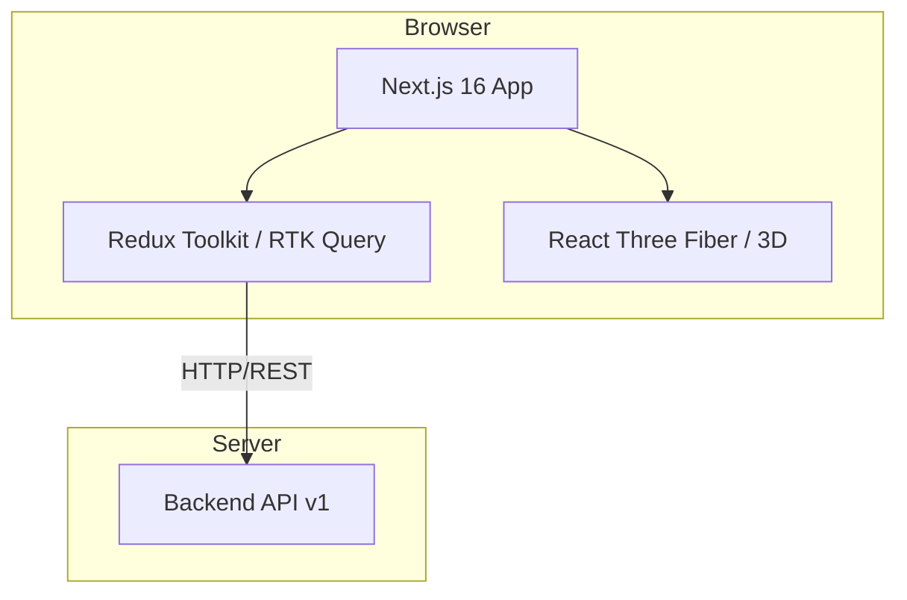

# 📘 Guide du Développeur Frontend - MILELE ACCOUNTING SOFTWARE

> **Guide pédagogique complet pour comprendre, maintenir et développer l'interface utilisateur du système MILELE**

---

## 📋 Table des Matières

1. [Vue d'ensemble du projet](#1-vue-densemble-du-projet)
2. [Structure du projet](#2-structure-du-projet)
3. [Technologies et bibliothèques](#3-technologies-et-bibliothèques)
4. [Architecture de l'application](#4-architecture-de-lapplication)
5. [Patterns et bonnes pratiques](#5-patterns-et-bonnes-pratiques)
6. [Configuration et développement](#6-configuration-et-développement)
7. [Guide de contribution](#7-guide-de-contribution)

---

## 1. Vue d'ensemble du projet

### 1.1 Rôle du Frontend

Le frontend MILELE est l'**interface utilisateur web** du système de gestion comptable et financière. Il permet aux utilisateurs de :

- 🔐 S'authentifier (JWT + Cookies)
- 📊 Visualiser les tableaux de bord financiers
- 💰 Gérer les factures (Ventes)
- 📈 Consulter les états comptables
- 👥 Administrer les utilisateurs, rôles et succursales
- 📦 Gérer les produits, tiers (clients/fournisseurs) et stocks
- 🏢 Configurer l'entreprise

### 1.2 Architecture Frontend



### 1.3 Stack Technique

- **Framework** : Next.js 16.1.3 (App Router + Turbopack)
- **Bibliothèque UI** : React 19
- **Langage** : TypeScript
- **Styling** : TailwindCSS v4
- **Composants** : Radix UI + shadcn/ui
- **État Serveur & API** : **Redux Toolkit (RTK Query)**
- **Authentification** : Cookies (`js-cookie`) + JWT
- **Formulaires** : React Hook Form + Zod
- **Animations & 3D** : Framer Motion, Three.js, React Three Fiber
- **Icônes** : Lucide React
- **Graphiques** : Recharts

---

## 2. Structure du projet

L'application suit une **architecture par fonctionnalités (Feature-based)** située dans `src/`.

```
milele-frontend/
├── src/
│   ├── app/                        # Next.js App Router (Routes & Layouts)
│   │   ├── (auth)/                 # Routes d'authentification (login, register)
│   │   ├── dashboard/              # Tableau de bord principal
│   │   ├── sales/                  # Module Ventes
│   │   ├── resources/              # Module Ressources (Produits, Tiers)
│   │   └── admin/                  # Module Administration
│   │
│   ├── features/                   # Logique métier par domaine
│   │   ├── auth/                   # Slices, API, types pour l'auth
│   │   ├── sales/                  # Composants, API pour les factures
│   │   ├── resources/              # Composants, API pour produits/tiers
│   │   └── admin/                  # Composants, API pour gestion système
│   │
│   ├── components/                 # Composants partagés
│   │   ├── ui/                     # Composants de base (shadcn/ui)
│   │   └── layout/                 # Sidebar, Headers, DashboardLayout
│   │
│   ├── services/                   # Configuration API globale (RTK Query)
│   │   └── api.ts                  # Base API avec gestion du Refresh Token
│   │
│   ├── store/                      # Configuration Redux Store
│   │   ├── index.ts                # Store principal
│   │   └── hooks.ts                # Typed hooks useAppDispatch/useAppSelector
│   │
│   ├── lib/                        # Utilitaires (cn, formatters)
│   ├── hooks/                      # Hooks transversaux (use-mobile.ts)
│   ├── schemas/                    # Schémas de validation globaux
│   └── types/                      # Types TypeScript globaux
│
├── public/                         # Assets statiques
├── components.json                 # Config shadcn/ui
├── package.json                    # Dépendances
└── tsconfig.json                   # Config TypeScript
```

---

## 3. Technologies et bibliothèques

### 3.1 Next.js 16 & React 19

Le projet utilise les dernières versions pour bénéficier des **Server Components** par défaut et d'une performance accrue avec **Turbopack** (`next dev --turbo`).

### 3.2 Redux Toolkit & RTK Query

C'est le cœur de la gestion des données.
- **RTK Query** (`src/services/api.ts`) gère le cache, les requêtes auto-générées et l'invalidation via les **Tags**.
- **BaseQuery** inclut un mécanisme automatique de **re-authentification** via refresh token si une erreur 401 survient.

### 3.3 TailwindCSS v4

Le projet utilise la version 4 de Tailwind, configurée via PostCSS pour une compilation ultra-rapide.

---

## 4. Architecture de l'application

### 4.1 Feature Pattern

Chaque module dans `src/features/` contient généralement :
- `api/` : Endpoints RTK Query spécifiques (injectés dans l'API centrale).
- `components/` : Composants spécifiques au domaine.
- `types/` : Interfaces TypeScript.
- `schemas/` : Schémas Zod pour les formulaires.

### 4.2 Gestion de l'Authentification

L'auth est persistée via `Cookies` (`accessToken`, `refreshToken`) et synchronisée dans le Redux Store (`authSlice`). Le header `Authorization` est automatiquement ajouté à chaque requête via `prepareHeaders` dans `api.ts`.

---

## 5. Patterns et bonnes pratiques

### 5.1 Utilisation de RTK Query

Ne pas faire de `useEffect` pour fetcher des données. Utiliser les hooks générés :

```tsx
const { data, isLoading } = useGetInvoicesQuery();
```

### 5.2 Formulaires Standardisés

Tous les formulaires utilisent `react-hook-form` avec le resolver `zod` et les composants de `src/components/ui/form.tsx`.

### 5.3 Sécurité des Types

Éviter l'utilisation de `any`. Utiliser les interfaces définies dans les dossiers `types/` de chaque feature.

### 5.4 Consommation API Robuste

Le backend renvoie souvent des réponses imbriquées (ex: `{ data: [...] }`). Pour éviter les erreurs `TypeError: data.map is not a function`, utiliser l'utilitaire `extractArray` :

```tsx
import { extractArray } from '@/lib/utils';

const { data: rawData } = useGetProductsQuery();
const products = extractArray<Product>(rawData); // ✅ Garanti d'être un tableau
```

Cet utilitaire gère les cas où les données sont :
1. Directement un tableau.
2. Un objet avec une propriété `data` qui est un tableau.
3. `undefined` ou `null` (renvoie `[]`).

---

## 6. Configuration et développement

### 6.1 Lancement

```bash
npm install
npm run dev
```

L'application tourne sur `http://localhost:3000` (Frontend) et communique avec le Backend sur `http://localhost:3001/api/v1` (via proxy ou config baseurl).

### 6.2 Variables d'Environnement

Variables clés à configurer dans `.env.local` :
- `NEXT_PUBLIC_API_URL` : URL de l'API backend.

---

## 7. Guide de contribution

### Ajouter une fonctionnalité
1. Créer le dossier dans `src/features/[nom]`.
2. Définir l'API dans `api/[nom]Api.ts` et l'injecter dans `src/services/api.ts`.
3. Créer les composants dans `components/`.
4. Ajouter la route correspondante dans `src/app/`.

### Ajouter un composant UI
Utiliser la CLI shadcn pour maintenir la cohérence :
```bash
npx shadcn@latest add [composant]
```

---

## 🎯 Conclusion

Ce guide est aligné avec l'implémentation actuelle de **MILELE**. Il privilégie la modularité via le pattern **Features** et la robustesse via **RTK Query** et **TypeScript**.

**Bon développement ! 🚀**
